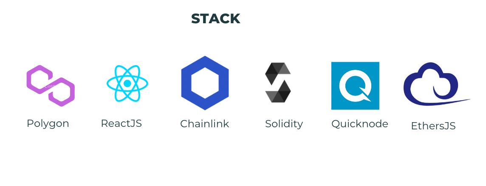
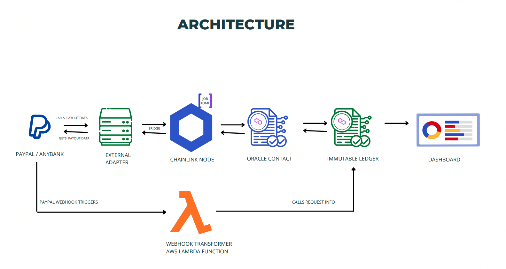

# Chainlink Fall 2022 Hackathon

<br>


<br>
<br>

## Problem

Often people who contribute/donate to campaigns run on these platforms are unaware of how the funds are being used: who are the exact people who have access to the funds, and where they are spending the money?

## Solution

The software as a service (SAAS) we created will solve the issue of lack of transparency in crowdfunding platforms. Our solution connects the bank accounts of the campaigns being run to a chainlink node, which writes all the bank transactions on an immutable ledger (blockchain), that in turn emits the transaction so that web2 nodes (on the crowd-funding platform) detect and record the transaction to display it to users of their platform.

## Stack We Used

<br>



<br>

1. Frontend: We used **React JS**, Tailwind CSS for UI and **ethers** library to fetch details from contract.

2. External Adapter: We used **Nodejs** server and **Paypal-sdk** for fetching payment details from paypal.

3. Blockchain :

   1. Smart Contract: We used **Solidity** for writing smart contracts.
   2. Development: **Remix** to write, compile in local system.
   3. Deployment: **Hardhat** to deploy to testnet and verify the contract.
   4. Chain: **Polygon Mumbai** to deploy smart contracts on testnet.
   5. RPC URL : We used **Quick Node** polygon RPC url to connect to the mumbai chain.

4. Chainlink:

   1. Oracle: We used Operator.sol for Oracle requests.
   2. Bridge: We used Bridge for connecting external adapter to the chainlink job.
   3. Job: Used to get data from external adapter and pass it to oracle.

5. Others: We used **Paypal** for transactions, **aws lambda** function as a webhook url for paypal.

# Architecture

<br>



<br>

## Steps to Run the Project

1. Clone the repo
2. Install the dependencies.
3. Create `.env` file and use your values for **ETH_URL** & **DATABASE_URL**. Run chainlink node using the command `npm run chainlink-node`.
4. Open this link in browser http://localhost:6688 and login useing your creds which you gave earlier while starting the node.
5. Deploy the Oracle Contract and make the node address as authorised.
6. Run the external adapter using command `npm start`.
7. Create a bridge with the adapter url.
8. Create a job using the bridge name we created earlier and the oracle contract address. You can use `./job-spec/job.toml` file for creating job.
9. Deploy Consumer Contract.

**Note:** You can use following commands to compile and deploy the project from local using hardhat. Or you can do it from Remix IDE.

```
    npm run hardhat
    npm run hardhat:compile
    npm run hardhat:deploy
```

<br>

## Meet Our Team

<div style="display: flex; justify-content: space-between; align-items: center;">
   <p style="flex:1">Shiva Kumar: </p>
   <div style="flex:4; justify-content: space-between;">
      <a href="https://www.linkedin.com/in/satyasandeep" target="_blank">
      
      </a>
      <a href="https://twitter.com/shivakmangina" target="_blank">
      
      </a>
      <a href="https://www.instagram.com/shiva_mangina" target="_blank">
      
      </a>
      <a href="https://github.com/shivamangina" target="_blank">
      
      </a>
   </div>
</div>

<div style="display: flex; justify-content: space-between; align-items: center;">
   <p style="flex:1">Sandeep Kumar: </p>
   <div style="flex:4; justify-content: space-between;">
      <a href="https://www.linkedin.com/in/satyasandeep" target="_blank">
      
      </a>
      <a href="https://twitter.com/satyasandeep76" target="_blank">
      
      </a>
      <a href="https://www.instagram.com/satyasandeep007" target="_blank">
      
      </a>
      <a href="https://github.com/satyasandeep007" target="_blank">
      
      </a>
   </div>
</div>

<div style="display: flex; justify-content: space-between; align-items: center;">
   <p style="flex:1">Ahmed Abusalama: </p>
   <div style="flex:4; justify-content: space-between;">
      <a href="https://www.linkedin.com/in/satyasandeep" target="_blank">
      
      </a>
      <a href="https://twitter.com/satyasandeep76" target="_blank">
      
      </a>
      <a href="https://www.instagram.com/satyasandeep007" target="_blank">
      
      </a>
      <a href="https://github.com/AhmedISalama" target="_blank">
      
      </a>
   </div>
</div>
<div style="display: flex; justify-content: space-between; align-items: center;">
   <p style="flex:1">Minhaj Al Abidin: </p>
   <div style="flex:4; justify-content: space-between;">
      <a href="https://www.linkedin.com/in/satyasandeep" target="_blank">
      
      </a>
      <a href="https://twitter.com/satyasandeep76" target="_blank">
      
      </a>
      <a href="https://www.instagram.com/satyasandeep007" target="_blank">
      
      </a>
      <a href="https://github.com/Minhajul0786" target="_blank">
      
      </a>
   </div>
</div>
<div style="display: flex; justify-content: space-between; align-items: center;">
   <p style="flex:1">Abdullah Zaman: </p>
   <div style="flex:4; justify-content: space-between;">
      <a href="https://www.linkedin.com/in/abdullah-zaman/" target="_blank">
      
      </a>
      <a href="https://twitter.com/satyasandeep76" target="_blank">
      
      </a>
      <a href="https://www.instagram.com/satyasandeep007" target="_blank">
      
      </a>
      <a href="https://github.com/satyasandeep007" target="_blank">
      
      </a>
   </div>
</div>

## Demo

Youtube Link :

Github Repos :

1. <a style="margin-bottom: 5px;" href="https://github.com/shivamangina/Chainlink-hackathon-fall-22-BE" target="_blank"> Backend </a>

2. <a href="https://github.com/shivamangina/Chainlink-hackathon-fall-22-FE" target="_blank"> Frontend
   </a>
